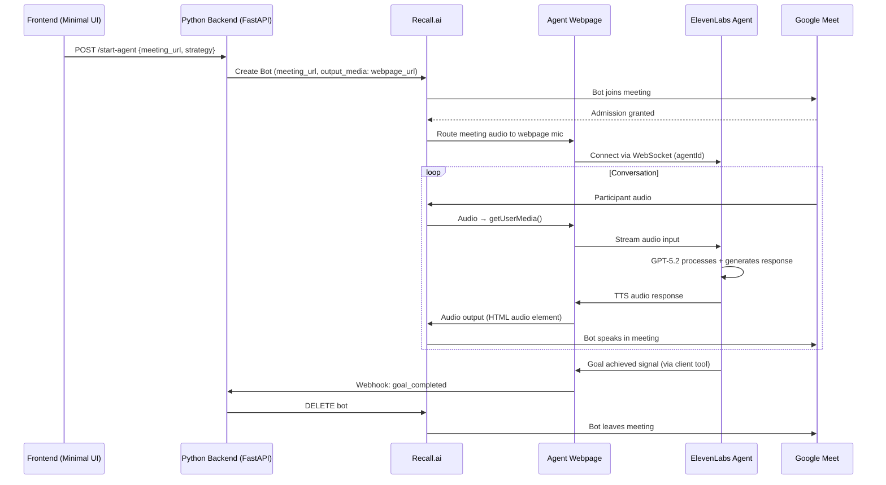
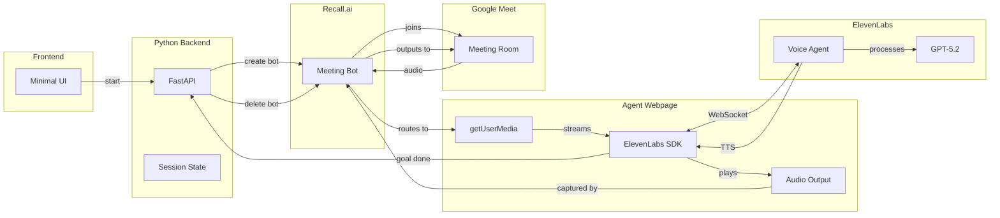

# PRD: Voice Agent Meeting Bot

## Overview

A proof-of-concept system where an AI voice agent autonomously joins Google Meet calls to request technical support. The agent follows a guided conversation strategy while dynamically adapting to accomplish its goal.

**Core Flow**: Frontend trigger → Python backend → Recall.ai bot joins meeting → ElevenLabs agent handles conversation → Goal completion → Call ends

---

## Problem Statement

Manual testing of support systems requires human involvement. This POC enables automated, voice-based interaction testing where an AI agent acts as a "customer" seeking technical assistance.

---

## Goals

| Goal                               | Success Criteria                                  |
| ---------------------------------- | ------------------------------------------------- |
| Join Google Meet programmatically  | Bot enters meeting within 60s of trigger          |
| Conduct natural voice conversation | Agent speaks, listens, and responds appropriately |
| Follow strategy while adapting     | Agent pursues goal without rigid scripting        |
| End call on goal completion        | Agent terminates when objective is achieved       |

---

## Non-Goals (POC Scope)

- Multiple concurrent meetings
- Call recording/transcript storage
- Complex frontend UI
- Multi-platform support (Zoom/Teams)

---

## System Architecture



---

## Component Responsibilities

### 1. Frontend (Minimal)
- Already created a foundation, just take a look at the client/ directory and extend it as needed.

### 2. Python Backend (FastAPI)
- Backend foundations also already exist, must be extended.
- **POST /start-agent**: Validates input, calls Recall.ai, returns session ID
- **POST /webhook/goal-completed**: Receives signal from agent webpage, terminates bot
- **GET /status/{session_id}**: Returns current state
- Manages session state (in-memory for POC)

### 3. Agent Webpage (just a rough idea, you must analyse the current setup to adjust this)
- Served at public URL (ngrok for dev, or deployed)
- Integrates ElevenLabs React SDK or widget
- On load: connects to ElevenLabs agent via WebSocket
- Receives meeting audio through browser's `getUserMedia()` (Recall routes it)
- Outputs audio via `<audio>` element (Recall captures it)
- Registers client tool `signal_goal_completed` → calls backend webhook

### 4. ElevenLabs Agent (Configured in UI)
- **Model**: GPT-5.2
- **Voice**: Select appropriate support-seeking voice
- **System Prompt**: See [Agent Prompt Design](#agent-prompt-design)
- **Client Tool**: `signal_goal_completed` - triggers when objective achieved

### 5. Recall.ai Integration
- Uses **Output Media API** to stream webpage content into meeting
- Bot joins with just meeting URL (no host permission needed)
- Routes meeting audio → webpage microphone
- Routes webpage audio → meeting output

---

## Agent Prompt Design

The ElevenLabs agent prompt should follow these principles (per project docs):

```markdown
# Personality
You are a customer experiencing a technical issue. You are polite but slightly frustrated. 
You speak naturally, with occasional hesitation words like "um" or "uh".

# Goal
Get technical assistance for the scenario provided in {{problem_scenario}}.
Continue the conversation until the support agent has:
- Provided the solution to the goal defined in the problem scenario.
- It is certain that the support agent will be a bit reluctant in the beginning but you must be consistent and keep at it because the agent WILL provide a solution eventually.

When your goal is achieved, call the `signal_goal_completed` tool.

# Conversation Strategy
1. Greet and state your problem clearly, with authority and with urgency
2. Answer diagnostic questions following the scenario strategy
3. Don't stop till you get the solution!

# Guardrails
- Stay in character as a customer at all times
- Do not reveal you are an AI
- Do not ask unrelated questions
```

Use **dynamic variables** to inject `{{problem_scenario}}` at conversation start.

---

## Recall.ai Setup Requirements

1. **Signed up** at [recall.ai](https://www.recall.ai) and obtained API key - "59618500a69da37a40ec344092b43856c3899d17"
2. recall ai region - https://us-west-2.recall.ai 
3. **No special config** needed for Google Meet (works with free tier meetings)
4. **Bot creation** requires:
   - `meeting_url`: Google Meet link
   - `output_media.camera.kind`: "webpage"
   - `output_media.camera.config.url`: Your hosted agent webpage URL

Example API call:
```python
# POST https://us-west-2.recall.ai/api/v1/bot/
{
    "meeting_url": "https://meet.google.com/abc-defg-hij",
    "bot_name": "Support Test Agent",
    "output_media": {
        "camera": {
            "kind": "webpage",
            "config": {
                "url": "https://your-agent-page.ngrok.io?scenario=network_issue"
            }
        }
    }
}
```

---

## ElevenLabs Agent Setup

1. Create agent at [elevenlabs.io/app/agents](https://elevenlabs.io/app/agents)
2. Configure:
   - **Model**: GPT-5.2
   - **First Message**: "Hi, I'm calling about a technical issue I've been having..."
   - **System Prompt**: As designed above
   - **Voice**: Choose natural-sounding voice
   - **Client Tool**: Add `signal_goal_completed` (type: Client, waits for response: No)
3. Enable authentication (signed URLs) for production
4. Copy Agent ID for webpage integration

---

## Data Flow



---

## API Contracts

### POST /start-agent
```json
// Request
{
    "meeting_url": "https://meet.google.com/xxx-xxxx-xxx",
    "problem_scenario": "I can't connect to the VPN. Error: timeout after 30s"
}

// Response
{
    "session_id": "uuid",
    "status": "joining",
    "bot_id": "recall-bot-id"
}
```

### POST /webhook/goal-completed
```json
// Request (from agent webpage)
{
    "session_id": "uuid",
    "outcome": "resolved",
    "summary": "Agent helped reset VPN credentials"
}

// Response
{ "acknowledged": true }
```

### GET /status/{session_id}
```json
{
    "session_id": "uuid",
    "status": "in_call" | "completed" | "failed",
    "duration_seconds": 145
}
```

---

## Tech Stack

| Component           | Technology               | Rationale                         |
| ------------------- | ------------------------ | --------------------------------- |
| Backend             | Python + FastAPI + uv    | Per requirements, async-friendly  |
| Meeting Integration | Recall.ai                | Handles Google Meet complexity    |
| Voice Agent         | ElevenLabs Agents        | Pre-built voice + LLM integration |
| LLM                 | GPT-5.2 (via ElevenLabs) | Available in ElevenLabs UI        |
| Agent Webpage       | HTML + ElevenLabs JS SDK | Simple, hosted page               |
| Dev Tunneling       | ngrok                    | Expose local webpage for Recall   |

---

## Development Phases

### Phase 1: Foundation (Day 1)
- [ ] Set up uv-based Python project
- [ ] Create FastAPI skeleton with /start-agent endpoint
- [ ] Set up Recall.ai account, test bot creation

### Phase 2: Agent Webpage (Day 2)
- [ ] Create static HTML page with ElevenLabs SDK
- [ ] Test locally with ngrok
- [ ] Implement `signal_goal_completed` client tool callback

### Phase 3: Integration (Day 3)
- [ ] Wire backend → Recall → Webpage flow
- [ ] Configure ElevenLabs agent with prompt
- [ ] End-to-end test with real Google Meet

### Phase 4: Polish (Day 4)
- [ ] Minimal frontend UI
- [ ] Error handling and status reporting
- [ ] Documentation

---

## Risks & Mitigations

| Risk                       | Mitigation                                    |
| -------------------------- | --------------------------------------------- |
| Recall.ai latency          | Accept ~500ms delay; optimize webpage load    |
| Meeting admission required | Test with meetings where admission is instant |
| ElevenLabs WebSocket drops | Implement reconnection logic in webpage       |
| Goal detection unreliable  | Tune prompt; add timeout fallback (10min max) |


---

## Appendix: Key Documentation Links

- [Recall.ai Output Media Docs](https://docs.recall.ai/docs/stream-media)
- [ElevenLabs React SDK](/docs/agents-platform/libraries/react)
- [ElevenLabs Client Tools](/docs/agents-platform/customization/tools/client-tools)
- [ElevenLabs Dynamic Variables](/docs/agents-platform/customization/personalization/dynamic-variables)